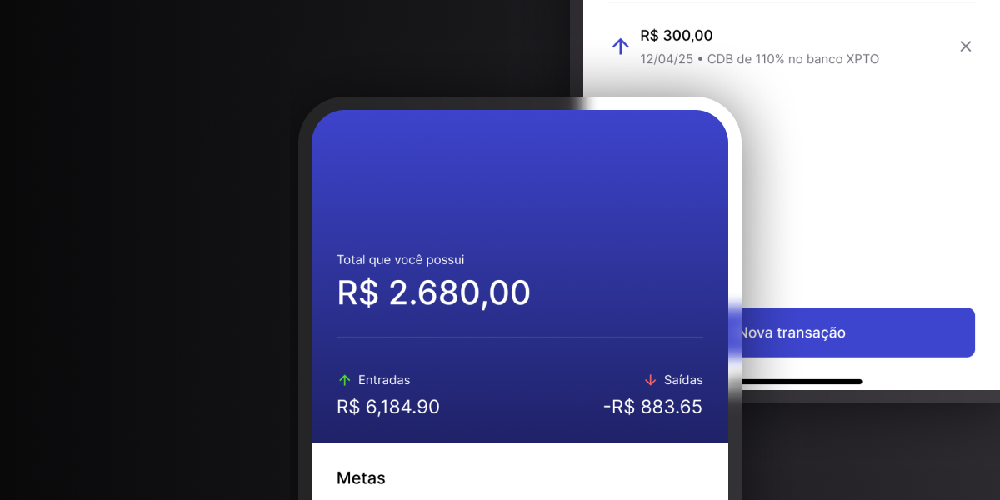

# Target - App de Metas Financeiras

Este projeto é um aplicativo mobile para cadastro e gestão de metas financeiras e transações.

# 

## 🚀 Funcionalidades Principais

### ✅ Criar e Gerenciar Metas
- Criar metas com:
  - Nome (ex: *Viagem*, *Apple Watch*).
  - Valor objetivo (quanto você precisa guardar).
- Editar metas:
  - Atualizar nome ou valor.
  - Remover metas existentes.
- Tela unificada para **criar e editar metas**.

---

### 🏠 Tela Inicial (Home)
- Exibição de **todas as metas** criadas.
- Informações exibidas:
  - Nome da meta.
  - Valor atual guardado.
  - Valor objetivo.
  - Progresso em porcentagem.
- **Barra de progresso** visual.
- Informações gerais:
  - Total disponível.
  - Entradas (valores guardados).
  - Saídas (valores retirados).

---

### 📊 Tela de Detalhes da Meta
- Visualização detalhada de uma meta específica:
  - Nome da meta.
  - Valor guardado.
  - Valor objetivo.
  - Porcentagem e progresso da meta.
- Lista de transações associadas:
  - Tipo (entrada ou saída).
  - Valor.
  - Data.
  - Motivo (opcional).

---

### ➕ Nova Transação
- Registrar movimentações financeiras por meta:
  - **Guardar** (entrada) ou **Resgatar** (saída).
  - Inserir valor.
  - Campo opcional para **motivo/observação**.
    - Exemplo: *"CDB 110% no Banco XPTO"*.

---

## ⚙️ Tecnologias e Recursos Utilizados
- **Banco de dados local** para persistência das informações.
- **Navegação baseada em arquivos** com **Expo Router**.
- **Gradiente de cores** para uma interface visualmente agradável.
- Componentes reutilizáveis e arquitetura escalável.

---

## 💡 Inspiração e Referência
Inspirado na funcionalidade de **"caixinhas" do Nubank** (antigo "porquinho"), onde o usuário separa valores com objetivos definidos.

---

## 👤 Autor

Feito com ♥ por Marcelo Galdino :wave: [Entre em contato!](https://www.linkedin.com/in/marcelogaldino/)

## 📝 Licença

Este projeto é distribuído sob a licença MIT.
